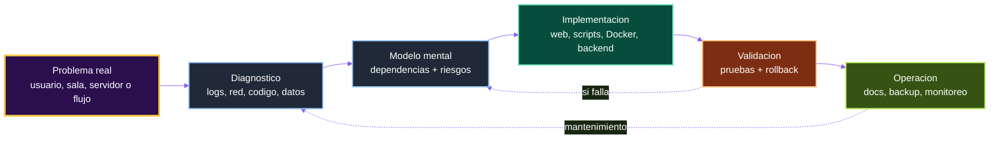
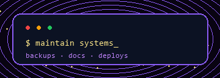

<p align="center">
  
</p>

<div align="center">

# JackStar · Pablo Elias Avendano Miranda

**Ingeniero en Informatica · desarrollo web · infraestructura · automatizacion · soporte TI · sistemas internos.**


[](https://jack.drakescraft.cl)
[](https://github.com/JackStar6677-1)
[](https://www.linkedin.com/in/pablo-el%C3%ADas-avenda%C3%B1o-miranda-b4b93b39a/)
[](https://github.com/DrakesCraft-Labs)
[](mailto:pablo.elias.miranda.292003@gmail.com)


</div>

## Perfil rapido

Construyo y mantengo sistemas reales: **sitios, servidores, automatizaciones, calendarios, herramientas internas y soporte tecnico**. Mi campo mezcla desarrollo, infraestructura, soporte en terreno, Minecraft tecnico, documentacion y operacion de servicios en produccion.

No me interesa mostrar solo repos sueltos. Me interesa mostrar continuidad: entender el problema, desplegar, monitorear, respaldar, documentar y mantener.

```text
Desarrollo web  ·  Infraestructura Linux  ·  Docker  ·  Cloudflare Tunnel
Automatizacion  ·  Soporte TI  ·  Calendarios  ·  Reservas
Veyon / laboratorios  ·  PostgreSQL  ·  PowerShell  ·  Python
Paper / Slimefun  ·  Portales publicos  ·  Backups  ·  Hardening
```

## Mapa de operacion

```mermaid
%%{init: {"theme": "base", "themeVariables": {"background": "transparent", "primaryColor": "#100B1F", "primaryTextColor": "#F8F7FF", "primaryBorderColor": "#F5C542", "lineColor": "#A855F7", "secondaryColor": "#1F143A", "tertiaryColor": "#07050F", "fontFamily": "Fira Code, Segoe UI, sans-serif"}}}%%
flowchart TB
  Jack["JackStar<br/>software + infra + automatizacion"]:::core

  subgraph Prod["Produccion real"]
    direction TB
    Star["star<br/>Ubuntu · Docker · Tailscale · Cloudflare Tunnel"]:::infra
    Calendar["CCAACalendar<br/>multicentro · reservas · Google Calendar"]:::product
    Portal["jack.drakescraft.cl<br/>portal profesional + API"]:::product
    Web["DrakesCraft Web<br/>portal publico"]:::product
  end

  subgraph Ops["Operacion y soporte"]
    direction TB
    Veyon["VeyonScripts<br/>laboratorios · red · diagnostico"]:::ops
    TI["Soporte TI<br/>equipos · salas · cableado · continuidad"]:::ops
    Backups["Backups + healthchecks<br/>Restic · systemd · fail2ban · UFW"]:::safe
  end

  subgraph Build["Construccion"]
    direction TB
    Backend["Backend<br/>Python · FastAPI · PHP · Java"]:::build
    Frontend["Frontend<br/>HTML · CSS · JS · React"]:::build
    Data["Datos<br/>PostgreSQL · MySQL · SQLite"]:::data
    Scripts["Automatizacion<br/>PowerShell · Bash · Python"]:::build
  end

  subgraph Game["DrakesCraft tecnico"]
    direction TB
    Paper["Paper / Slimefun<br/>plugins · rendimiento · mantenimiento"]:::game
    Labs["DrakesCraft-Labs<br/>mods, addons y tooling"]:::game
  end

  subgraph Lab["Laboratorio personal"]
    direction TB
    Astro["AstroControlSim<br/>simulacion/control"]:::lab
    Aurex["Aurexalis<br/>browser architecture"]:::lab
    Omni["omnisky-miner<br/>observatorio local"]:::lab
    Tools["AureonVault · VotV editor<br/>utilidades Windows"]:::lab
  end

  Jack --> Prod
  Jack --> Ops
  Jack --> Build
  Jack --> Game
  Jack --> Lab
  Build --> Prod
  Ops --> Prod
  Game --> Web
  Backups --> Star
  Star --> Calendar
  Star --> Portal
  Star --> Web

  classDef core fill:#2B0E4E,stroke:#F5C542,stroke-width:3px,color:#F8F7FF;
  classDef infra fill:#111827,stroke:#22D3EE,stroke-width:2px,color:#F8F7FF;
  classDef product fill:#065F46,stroke:#6EE7B7,stroke-width:2px,color:#F8F7FF;
  classDef ops fill:#1E3A8A,stroke:#93C5FD,stroke-width:2px,color:#F8F7FF;
  classDef build fill:#1F143A,stroke:#A855F7,stroke-width:2px,color:#F8F7FF;
  classDef data fill:#7C2D12,stroke:#FDBA74,stroke-width:2px,color:#F8F7FF;
  classDef safe fill:#365314,stroke:#BEF264,stroke-width:2px,color:#F8F7FF;
  classDef game fill:#581C87,stroke:#C084FC,stroke-width:2px,color:#F8F7FF;
  classDef lab fill:#312E81,stroke:#A5B4FC,stroke-width:2px,color:#F8F7FF;
```



## Infraestructura viva

Mantengo `star`, un servidor Ubuntu usado para servicios reales. La parte publica vive detras de Cloudflare Tunnel; los paneles de administracion quedan protegidos por Tailscale y firewall.

| Servicio | Dominio / rol | Enfoque |
|---|---|---|
| **CCAACalendar** | [calendar.drakescraft.cl](https://calendar.drakescraft.cl) | Calendario multicentro con reservas, centros, autenticacion e integracion Google Calendar. |
| **Jack Portal** | [jack.drakescraft.cl](https://jack.drakescraft.cl) | Portal profesional con backend liviano, API publica y formulario validado. |
| **DrakesCraft Web** | [web.drakescraft.cl](https://web.drakescraft.cl) | Portal publico del ecosistema DrakesCraft. |
| **Observabilidad** | Tailscale interno | Healthchecks, Uptime Kuma, Portainer y Webmin protegidos. |
| **Continuidad** | servidor `star` | Restic backups, timers systemd, UFW, fail2ban y rotacion de logs Docker. |

> No publico rutas privadas, IPs internas, paneles de administracion ni secretos. Lo importante aqui es el criterio operativo: produccion, monitoreo, backups y rollback.

## Proyectos vivos y que demuestran

| Proyecto | Campo | Que representa |
|---|---|---|
| [CCAACalendar](https://github.com/JackStar6677-1/CCAACalendar) | Producto web / calendario | Plataforma multicentro para calendarios institucionales, reservas, Google Calendar y coordinacion de espacios. |
| [jack-portal](https://github.com/JackStar6677-1/jack-portal) | Portal profesional | Landing publica con backend liviano, API, validaciones y despliegue Docker. |
| [drakescraft-web](https://github.com/JackStar6677-1/drakescraft-web) | Web publica | Portal del ecosistema DrakesCraft, identidad y presencia web. |
| [VeyonScripts](https://github.com/JackStar6677-1/VeyonScripts) | Soporte TI / laboratorios | Automatizacion y diagnostico para laboratorios con Veyon, escaneo de red y mapeo operativo. |
| [CastelRoomKeeper](https://github.com/JackStar6677-1/CastelRoomKeeper) | Reservas escolares | Sistema de calendario y reservas de salas para entorno escolar. |
| [castel-credcam](https://github.com/JackStar6677-1/castel-credcam) | Tooling local | Captura y preparacion de fotos tipo credencial por curso. |
| [DrakesCraft-Labs](https://github.com/DrakesCraft-Labs) | Minecraft tecnico | Organizacion para plugins, ports, pruebas y herramientas Paper / Slimefun. |
| [StellarDaybook](https://github.com/JackStar6677-1/StellarDaybook) | Memoria tecnica | Bitacora automatizada para commits, rutina y continuidad diaria. |

## Laboratorio tecnico

Tambien mantengo exploraciones de largo plazo. No todo esta pensado como producto inmediato; algunas lineas son investigacion, arquitectura o tooling personal.

| Repo | Exploracion |
|---|---|
| [Aurexalis](https://github.com/JackStar6677-1/Aurexalis) | Arquitectura de navegador personal basada en Gecko/Floorp, Rust y UI reactiva. |
| [AstroControlSim](https://github.com/JackStar6677-1/AstroControlSim) | Simulacion/control y modelos de sistemas tecnicos. |
| [omnisky-miner](https://github.com/JackStar6677-1/omnisky-miner) | Observatorio virtual local con dashboard y base SQLite. |
| [Coronalis](https://github.com/JackStar6677-1/Coronalis) | Addon Slimefun con mecanicas astronomicas. |
| [AureonVault](https://github.com/JackStar6677-1/AureonVault) | Exploracion de file manager local para Windows. |
| [VotV-Points-Editor](https://github.com/JackStar6677-1/VotV-Points-Editor) | Utilidad segura con backups para editar puntos de Voices of the Void. |

## Stack de batalla

<div align="center">


<br />


</div>

## Como trabajo



- **Primero entiendo el sistema vivo.** Si hay usuarios, servidor, datos o produccion, la prioridad es no romper.
- **Automatizo lo repetitivo.** Python, PowerShell y Bash son herramientas operativas, no decoracion.
- **Diseño pensando en continuidad.** Backups, healthchecks, logs, rollback y documentacion importan desde el inicio.
- **Trabajo entre capas.** Puedo pasar de frontend a backend, de Docker a DNS, de soporte TI a scripts de laboratorio.
- **Uso IA como copiloto tecnico.** Acelera investigacion, prototipos y mantenimiento; el criterio final sigue siendo humano.

<p align="center">
  
</p>

## GitHub

<div align="center">


</div>

## Mas contexto

Hay una version ampliada en [README.extendido.md](./README.extendido.md). Esta portada resume lo principal: amplitud tecnica, sistemas vivos, proyectos reales y laboratorio personal.


