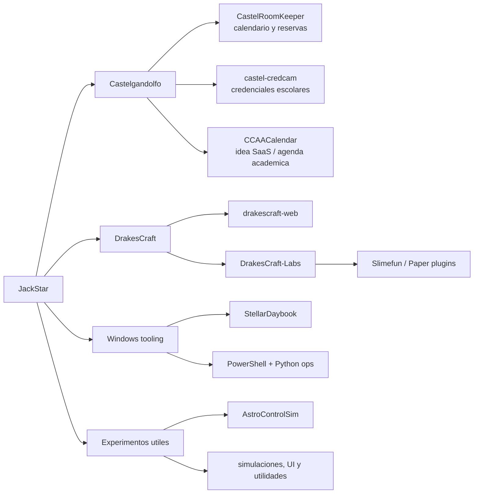
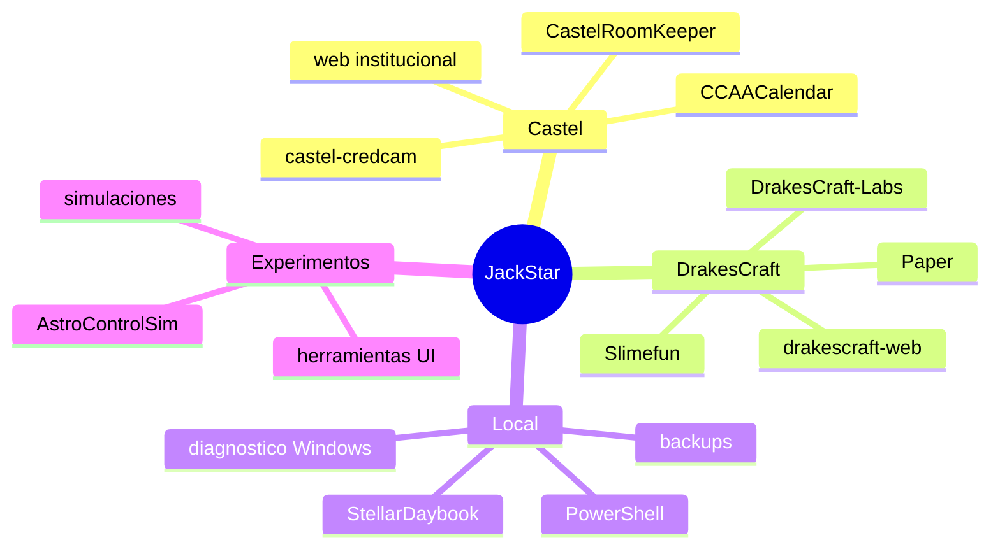

  

# JackStar · Pablo Elias Avendano Miranda

**Sistemas reales, automatizacion, servidores Minecraft, tooling Windows y web institucional.**

## Quien soy ahora

Soy estudiante de Ingenieria en Informatica en DUOC y trabajo como una mezcla bastante real de desarrollador, sysadmin practico y operador de sistemas que no viven solo en local. Me gusta convertir problemas sueltos en herramientas que alguien pueda usar: calendarios, paneles, scripts, automatizaciones, sitios publicos, plugins y utilidades para Windows.

Mi foco actual esta menos en "tener muchos repos" y mas en dejar proyectos con dueño, proposito y mantenimiento posible. Si algo esta publico aca, idealmente tiene una razon para existir.

## Mapa operativo

## Proyectos vivos

| Proyecto | Que representa |
|---|---|
| [CastelRoomKeeper](https://github.com/JackStar6677-1/CastelRoomKeeper) | Calendario operativo del Castel, nacido desde una web viva con backend real y sincronizacion con produccion. |
| [CCAACalendar](https://github.com/JackStar6677-1/CCAACalendar) | Evolucion separada: una agenda/calendario mas ambiciosa para reservas, salas y flujos academicos. |
| [castel-credcam](https://github.com/JackStar6677-1/castel-credcam) | Captura y preparacion de credenciales escolares, pensada para uso practico en terreno. |
| [drakescraft-web](https://github.com/JackStar6677-1/drakescraft-web) | Sitio publico de [DrakesCraft](https://drakescraft.cl), identidad y presencia web del servidor. |
| [DrakesCraft-Labs](https://github.com/DrakesCraft-Labs) | Organizacion para plugins, pruebas y herramientas del ecosistema Paper / Slimefun. |
| [StellarDaybook](https://github.com/JackStar6677-1/StellarDaybook) | Bitacora personal automatizada: commits, rutina y memoria tecnica del dia a dia. |
| [AstroControlSim](https://github.com/JackStar6677-1/AstroControlSim) | Linea de simulacion/control, una rama mas experimental y de largo plazo. |

## Stack de batalla

 

## Como trabajo

- **Primero entiendo el sistema vivo.** Si hay servidor, usuarios, FTP, VPS o datos reales, la prioridad es no romperlo.
- **Automatizo lo repetitivo.** Python y PowerShell son mis herramientas de confianza cuando el problema es operativo.
- **Documento lo que va a doler despues.** Prefiero un README util, una nota de rollback o un script claro antes que magia imposible de repetir.
- **Limpio sin borrar identidad.** Repos archivados, movidos o separados cuando corresponde; lo que queda visible tiene que contar algo verdadero.
- **Uso IA como copiloto tecnico.** Acelera investigacion, prototipos y mantenimiento, pero el criterio final sigue siendo humano.

## Constelacion actual

## GitHub

## Repos destacados

## Mas contexto

Hay una version mas larga y menos visual en [README.extendido.md](./README.extendido.md). Este perfil es la portada: lo importante, lo vivo y lo que vale mostrar primero.

